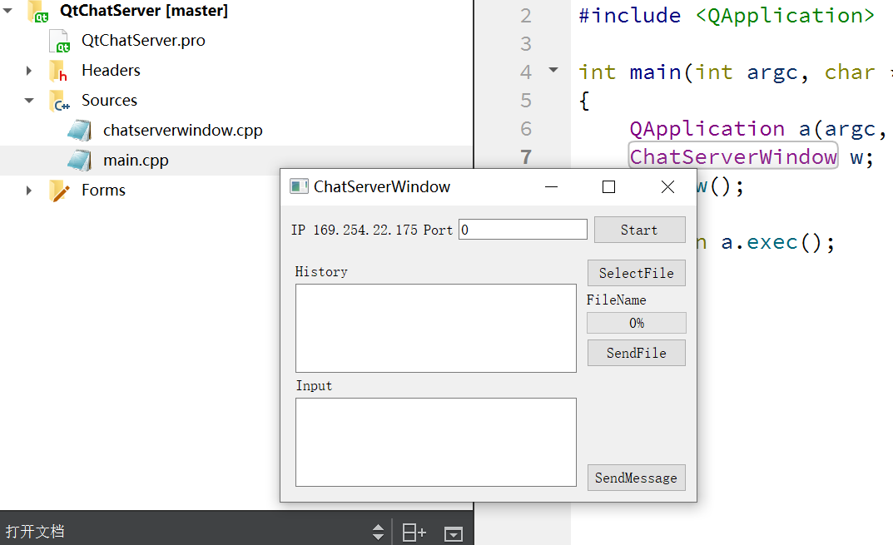
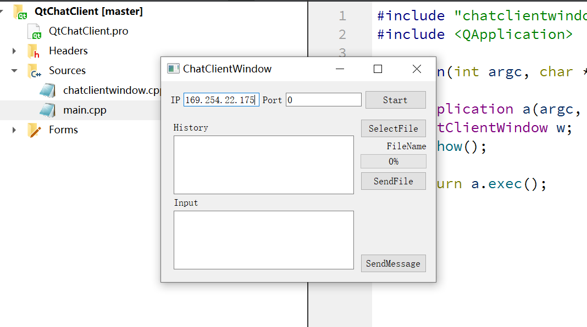
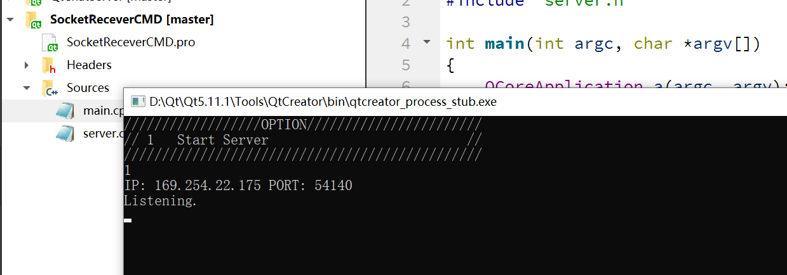
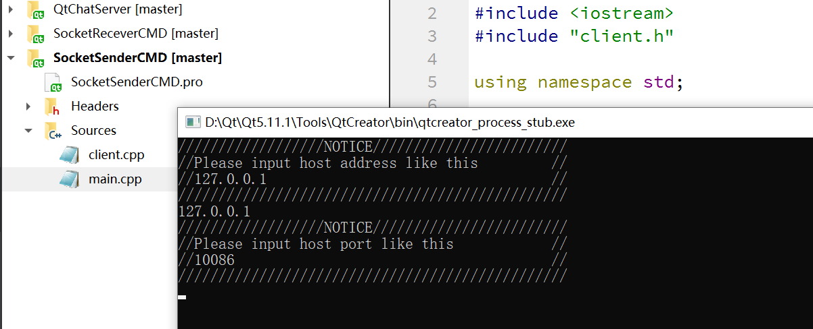

# QtSocketChatLee
This is a chat/file transfer software based on Qtsocket.
by BingLee 2021-2-22

这个项目由四个工程组成分别是：

- QtChatClient UI交互的客户端
- QtChatServer UI交互的服务端
- SocketSenderCMD 命令行交互客户端
- SocketReceverCMD 命令行交互服务端

区别是UI版同时实现了聊天信息传输和文件传输，命令行版只能单向进行文件发送。

# User Guide

## QtChatServer

点击Start后会自动监听一个端口号。

## QtChatClient

输入端口号后点击Start。

## SocketReceverCMD

## SocketSenderCMD

